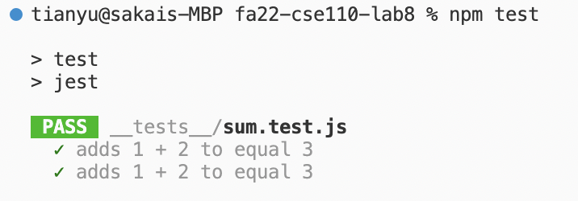
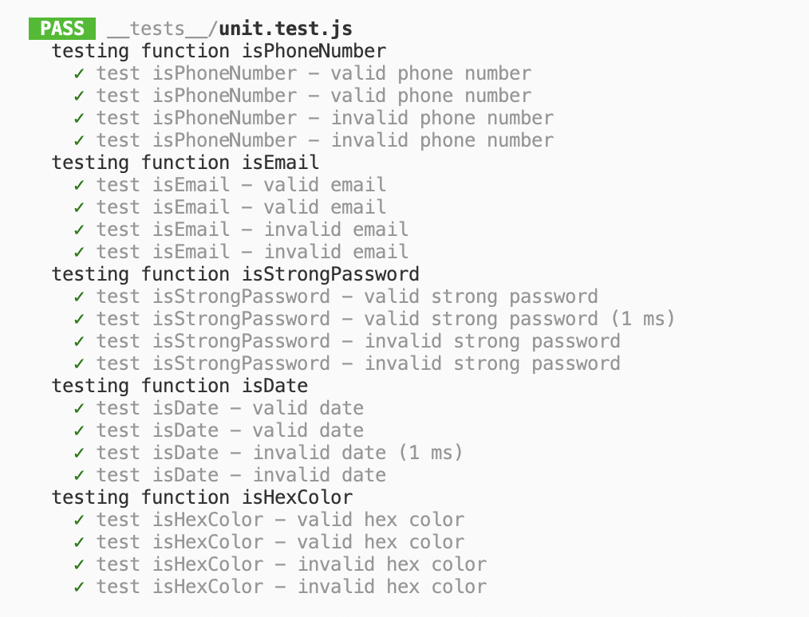
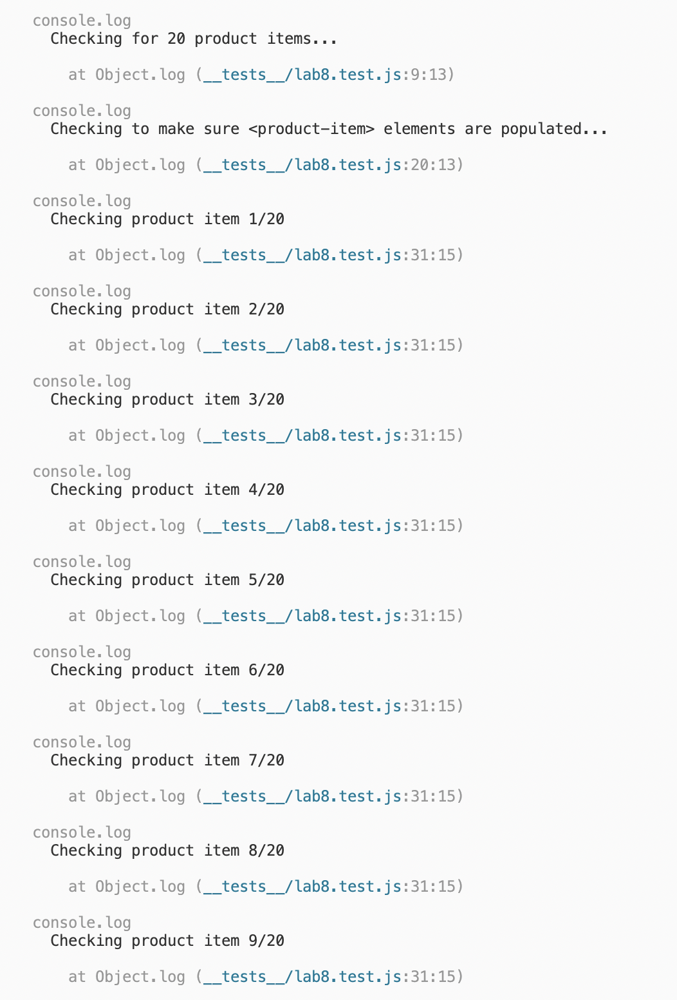
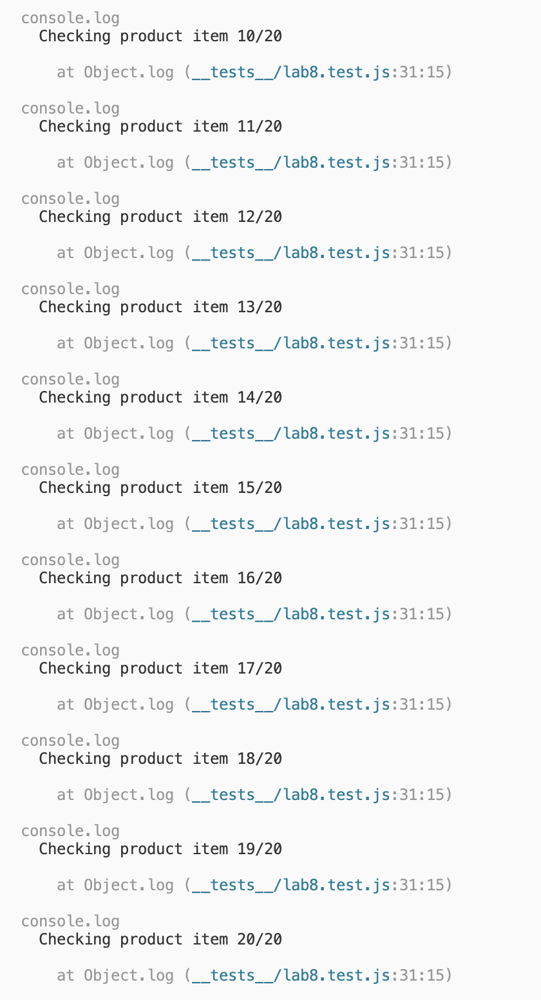
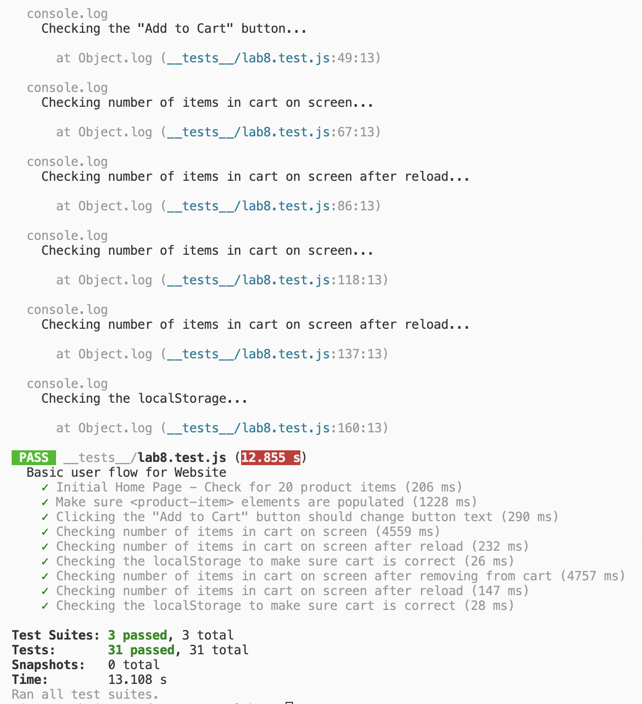

# CSE 110 Lab 8

**Name: Tianyu Chen**

## Check Your Understanding

1) Where would you fit your automated tests in your Recipe project development pipeline? Select one of the following and explain why.

Within a Github action that runs whenever code is pushed. Explanation: using GitHub actions, we can avoid manually testing our code. The tests will run automatically every time we push the code which can save us a lot of effort. Also the test results can be easily shared with teammates if this is a group project.

2) Would you use an end to end test to check if a function is returning the correct output? (yes/no)

No. Explanation: End to end tests are good for automating test cases that involve emulating user actions from start to finish. To test a single function's output, we should use a unit test.

3) Would you use a unit test to test the “message” feature of a messaging application? Why or why not? For this question, assume the “message” feature allows a user to write and send a message to another user.

No. Explanation: The "message" feature is a complex user action involving multiple steps for interaction. Therefore, an end to end test would be more suitable.

4) Would you use a unit test to test the “max message length” feature of a messaging application? Why or why not? For this question, assume the “max message length” feature prevents the user from typing more than 80 characters.

Yes. Explanation: In this case, we are only testing an individual part of code in an encapsulated unit, i.e. checking max message length. Thus, unit testing is a good choice.

## Screenshots

